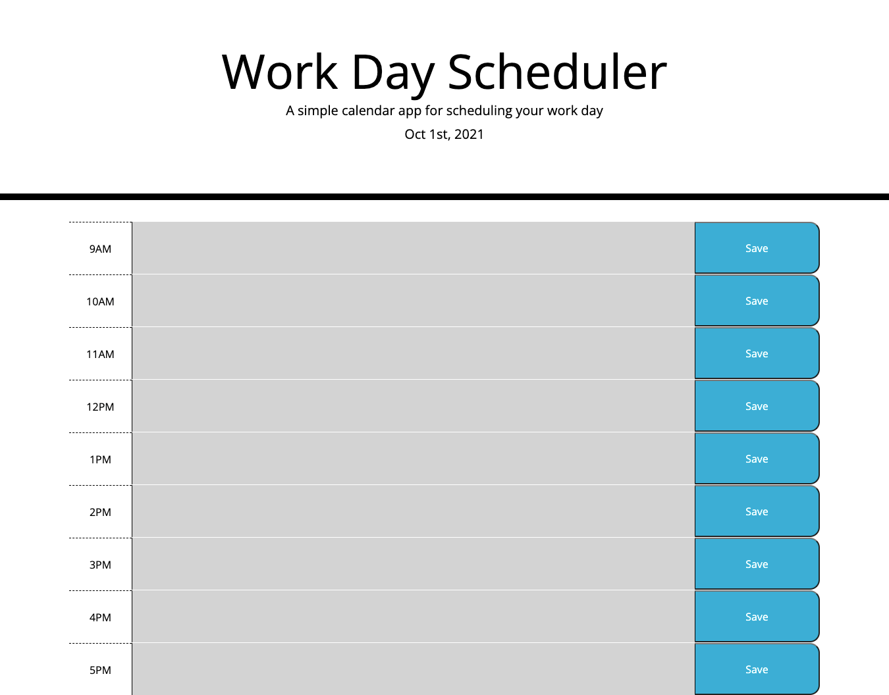

# Work Day Scheduler 

[https://jayladenae.github.io/Work-Day-Scheduler/](https://jayladenae.github.io/Work-Day-Scheduler/)

## Description

This is a simple color coded work day planner. There are time-blocks from 9:00 AM to 5:00 PM for typical work hours. These 
time-blocks are color coded for representation of past, present, and futer tasks. Past task's background colors are gray, present task's background colors are red, and future task's background colors are green. 

### User Story

```md
GIVEN I am using a daily planner to create a schedule
WHEN I open the planner
THEN the current day is displayed at the top of the calendar
WHEN I scroll down
THEN I am presented with timeblocks for standard business hours
WHEN I view the timeblocks for that day
THEN each timeblock is color coded to indicate whether it is in the past, present, or future
WHEN I click into a timeblock
THEN I can enter an event
WHEN I click the save button for that timeblock
THEN the text for that event is saved in local storage
WHEN I refresh the page
THEN the saved events persist
```


-This screenshot was taken at around 8 PM, so all of the text areas background colors are gray.-

### Credits
- Ismeny Saguilan
- Ethan Cho 
- Stephanie Cortez
- Sue Lee

### License


